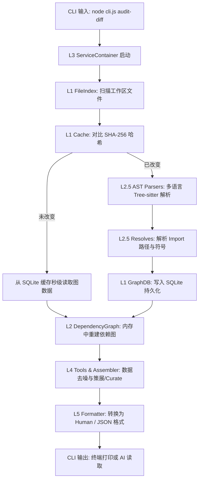

# workspace-bridge 极简架构指南 (Human-Readable Architecture)

> "过度工程是万恶之源。优秀的程序员写出简单到没有明显 bug 的代码，而不是复杂到看不出 bug 的代码。" —— 拿 Linus Torvalds 的品味来审视这个项目，你会发现它干净得令人发指。

`workspace-bridge` 不是一个装模作样的 SonarQube 替代品，也不是大包大揽的 IDE 插件。它是一个**给本地 AI Agent（比如 Antigravity、Claude）准备的“跨文件视角侦察兵”**。

它只回答两个核心问题：
1. **谁依赖谁，改了会波及谁？** (依赖图与影响面评估)
2. **当前仓库烂不烂，我要从哪下手？** (健康度审计与死代码清理)

---

## 1. 核心数据流：一图看懂

下面是 `workspace-bridge` 从启动到输出结果的完整生命周期。没有虚头八脑的中间件，就是一条干净的单向流水线：



---

## 2. 架构分层：从地基到喇叭

整个项目只有 7 层，依赖关系非常严格：**只能上层依赖下层，绝对禁止下层反向引用上层。**

```
 L5: CLI / Formatter     <-- 负责吹喇叭（解析参数、格式化输出）
       │
 L4: Tools & Assembler   <-- 负责当军师（去噪、聚合、生成行动计划）
       │
 L3: Container           <-- 负责发执照（极简的依赖注入容器）
       │
 L2 & L2.5: Core Engines <-- 负责动脑子（AST解析、符号查找、图计算）
       │
 L1: FileIndex & Cache   <-- 负责搬砖（文件哈希、SQLite 高速缓存）
       │
 L0: Utils & Constants   <-- 负责垫底（路径转换、字符串清洗）
```

### L0 基础设施 (地基)
* **代表文件**：`src/utils/path.js`, `src/utils/sanitize.js`
* **干了啥**：抹平 Windows 和 POSIX 路径差异，过滤危险的 Shell 字符。
* **品味点**：绝对不调高大上的路径库，用最直接的正则和字符串处理解决 Windows 路径斜杠 (`\`) 的历史旧账。

### L1 存储与索引 (搬砖工)
* **代表文件**：`src/services/file-index.js`, `src/services/cache.js`, `src/services/graph-db.js`
* **干了啥**：
  * `FileIndex` 快速扫盘，找出谁是孤儿，谁是测试。
  * `Cache` 和 `GraphDB` 负责把解析好的依赖关系持久化到 SQLite 数据库中。
  * 每次启动，它会对比文件 **SHA-256 哈希**。**哈希没变？那就不解析，直接读缓存！** 这就是为什么 1000 个文件的项目它能在 0.5 秒内完成分析的原因。
* **品味点**：
  * **物理隔离**：不同的工作区（Workspace）会根据路径的 MD5 哈希在本地生成不同的 SQLite 数据库文件，互不干扰，清理极易。

### L2 & L2.5 核心与子引擎 (大脑)
* **代表文件**：`src/services/dep-graph/` 下的所有文件
* **干了啥**：
  * **AST Parsers** (`parsers/js.js`, `parsers/python.js` 等)：支持 9 种语言。拒绝瞎猜的正则匹配，用正规的 **Tree-sitter WASM** 进行语法树解析，精确提取 `import`/`export`/`require` 和符号。
  * **Resolvers** (`resolvers.js`)：把 `import { foo } from '@/utils'` 这种花哨的别名或者相对路径，真实还原成磁盘上的物理文件路径。
  * **Impact Analyzers** (`symbol-impact.js`, `function-impact.js`)：在依赖图上跑 **PageRank** 或者 **BFS/DFS 深度优先搜索**。你改了一个底层的 utils 函数，它能顺藤摸瓜把上游所有受影响的 API 和对应要跑的测试文件全部找出来。
* **品味点**：
  * **边界消除 > if**：当解析器遇到不支持的语言时，不会抛出一堆 error 挂掉，而是优雅地退化（Fallback）到通用解析器，避免阻塞整个分析流。

### L3 服务组装 (粘合剂)
* **代表文件**：`src/services/container.js`
* **干了啥**：
  * `ServiceContainer` 是唯一的管家。它负责按照**地基 -> 存储 -> 核心 -> 工具**的依赖顺序，初始化所有的单例服务，并在退出时逐个执行安全清理（异常安全）。
* **品味点**：
  * **拒绝过度工程**：没有采用任何令人作呕的庞大 Spring-like 依赖注入（DI）框架，就 100 多行纯 JS 代码，靠一个简单的 `Map` 和手写的依赖声明完成了所有单例的初始化。生命周期极其清晰。

### L4 工具编排与策展 (军师)
* **代表文件**：`src/tools/audit-assembler.js`, `src/tools/overview-tools.js`
* **干了啥**：
  * AI 不需要海量垃圾报告，AI 需要**精准的行动指南**。
  * 这一层叫“策展层（Curation Layer）”。它负责把底层计算出来的原始数据（如 1000 个依赖节点）进行噪声过滤（去噪），按照高危程度、受波及面进行排序，组合成诸如“健康度评分”、“未解析依赖列表”、“建议先跑的测试”等高价值结论。

### L5 CLI 与格式化 (喇叭)
* **代表文件**：`cli.js`, `src/cli/formatters/human-formatters.js`
* **干了啥**：
  * 命令分发：把 `audit-summary` 路由到对应的 Tool 方法。
  * 格式输出：把核心数据翻译成人能看懂的紧凑终端表格，或者 AI 喜欢读的 JSON。
* **品味点**：
  * **消灭 switch-case 的 RegistryRefactoring**：原本 `human-formatters.js` 充斥着几千行臭长、极难维护的 `switch(command)` 逻辑。本轮我们通过 **Registry 模式** 将其重构成了一个配置映射表（Registry Map），使每个命令的格式化函数完全内聚，消除了 3 级以上的缩进，是极简工程品味的胜利。

---

## 3. 本项目尊崇的工程品味 (Linus Creed)

我们写代码时绝不妥协的几条硬核法则：

1. **CLI-first，谢绝 MCP 协议膨胀**
   * 我们彻底干掉了 MCP（Model Context Protocol）协议层。AI 最好也是最稳定的接口就是 CLI。让 AI 在沙盒里执行 `node cli.js` 是最简单、最快、最不易出错的方式。没有复杂的网络通信，没有多余的依赖。
2. **异常安全是底线**
   * 任何 `shutdown()` 或 `close()` 清理逻辑，必须逐个步骤包裹在独立的 `try-catch` 中。进程遇到 `SIGINT` / `SIGTERM` 必须优雅退出，绝不能把句柄或临时数据库锁死在磁盘上。
3. **数据不可变与单向流**
   * 缓存里的数据绝对不能直接暴露给外部去 `push` 或修改。同一业务语义只在单一模块实现，宁可写 500 行的内聚函数，也绝不拆成 5 个为了拆分而拆分的“哑巴类”。

---

## 4. 开发者快速上手

### 想新增一个 CLI 命令？
1. 在 `src/cli/commands/` 目录下增加你的命令逻辑。
2. 在 `src/cli/formatters/human-formatters.js` 的配置注册表里注册你的格式化输出函数。
3. 在 `cli.js` 中使用 `yargs` 或者命令路由器注册它。

### 想新增一个语言解析器？
1. 在 `src/services/dep-graph/parsers/` 下新建 `yourlang.js`，实现 `parse(fileContent)` 接口，提取 `imports` 和 `exports`。
2. 在 `src/services/dep-graph/parsers/registry.js` 中把新 parser 注册进去。

### 怎么跑测试验证？
```bash
# 快速跑完所有单元测试与集成测试，必须 96/96 全绿
npm run test:fast
```

---

> **记住**：`workspace-bridge` 的目标是**保持极简，足够好用，然后闭嘴。** 不要往里面塞多余的语义安全检测，那是大模型在语义层该干的事，不是结构化脚手架该干的事。
