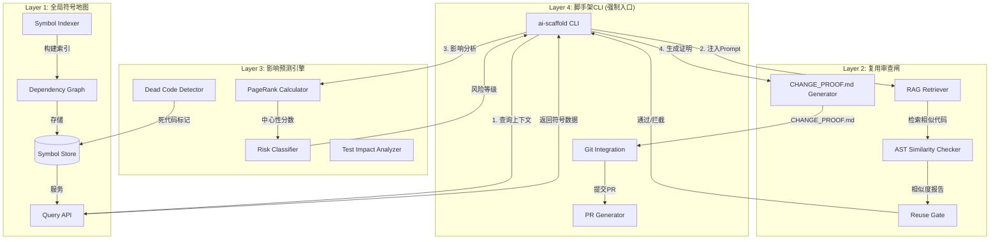
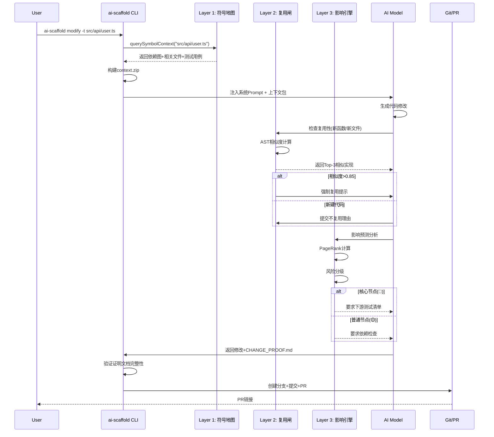
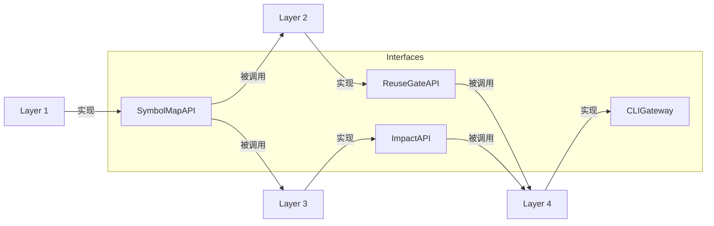
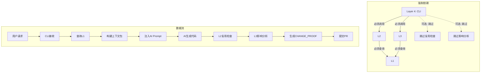

# AI认知脚手架系统 - 四层架构设计

> 版本: 1.0.0  
> 文档类型: 技术架构规范  
> 覆盖语言: TypeScript, Python, Go, Rust

---

## 1. 架构总览

### 1.1 四层架构图 (Mermaid)



### 1.2 数据流时序图



---

## 2. Layer 1: 全局符号地图 (Global Symbol Map)

### 2.1 核心JSON Schema

```json
{
  "$schema": "http://json-schema.org/draft-07/schema#",
  "title": "GlobalSymbolMap",
  "description": "AI认知脚手架 - 全局符号地图",
  "type": "object",
  "required": ["version", "project_id", "generated_at", "symbols", "files", "dependencies"],
  
  "properties": {
    "version": {
      "type": "string",
      "description": "Schema版本",
      "default": "1.0.0"
    },
    "project_id": {
      "type": "string",
      "description": "项目唯一标识(UUID)"
    },
    "generated_at": {
      "type": "string",
      "format": "date-time",
      "description": "索引生成时间戳"
    },
    "indexer": {
      "type": "object",
      "required": ["tool", "version"],
      "properties": {
        "tool": {
          "enum": ["lsif", "tree-sitter", "scip"],
          "description": "索引工具类型"
        },
        "version": { "type": "string" },
        "languages": {
          "type": "array",
          "items": { "type": "string" }
        }
      }
    },
    
    "symbols": {
      "type": "array",
      "items": { "$ref": "#/definitions/Symbol" }
    },
    
    "files": {
      "type": "array",
      "items": { "$ref": "#/definitions/File" }
    },
    
    "dependencies": {
      "type": "array",
      "items": { "$ref": "#/definitions/Dependency" }
    }
  },
  
  "definitions": {
    "Symbol": {
      "type": "object",
      "required": ["id", "name", "type", "language", "location"],
      "properties": {
        "id": {
          "type": "string",
          "description": "全局唯一标识: file_path#symbol_name",
          "examples": ["src/services/user.ts#validateUser"]
        },
        "name": { "type": "string" },
        "type": {
          "enum": [
            "function", "method", "class", "interface", 
            "type", "variable", "constant", "enum",
            "module", "namespace", "trait", "struct"
          ]
        },
        "language": {
          "enum": ["typescript", "python", "go", "rust", "javascript"]
        },
        "location": {
          "type": "object",
          "required": ["file_path", "line_range"],
          "properties": {
            "file_path": { "type": "string" },
            "line_range": {
              "type": "array",
              "minItems": 2,
              "maxItems": 2,
              "items": { "type": "integer" }
            },
            "column_range": {
              "type": "array",
              "minItems": 2,
              "maxItems": 2,
              "items": { "type": "integer" }
            }
          }
        },
        "signature": {
          "type": "string",
          "description": "函数签名/类型定义文本"
        },
        "documentation": {
          "type": "string",
          "description": "JSDoc/Docstring内容"
        },
        "visibility": {
          "enum": ["public", "private", "protected", "internal"]
        },
        "dependencies": {
          "type": "array",
          "items": { "type": "string" },
          "description": "此symbol依赖的其他symbol ID列表"
        },
        "dependents": {
          "type": "array",
          "items": { "type": "string" },
          "description": "依赖此symbol的其他symbol ID列表"
        },
        "metadata": {
          "type": "object",
          "properties": {
            "created_at": { "type": "string", "format": "date-time" },
            "last_modified": { "type": "string", "format": "date-time" },
            "modified_by": { "type": "string" },
            "commit_hash": { "type": "string" },
            "reuse_count": { "type": "integer", "default": 0 },
            "dead_flag": { "type": "boolean", "default": false },
            "test_coverage": { "type": "number", "minimum": 0, "maximum": 1 },
            "complexity_score": { "type": "number" },
            "page_rank": { "type": "number" }
          }
        },
        "language_specific": {
          "oneOf": [
            { "$ref": "#/definitions/TypeScriptSpecific" },
            { "$ref": "#/definitions/PythonSpecific" },
            { "$ref": "#/definitions/GoSpecific" },
            { "$ref": "#/definitions/RustSpecific" }
          ]
        }
      }
    },
    
    "TypeScriptSpecific": {
      "type": "object",
      "properties": {
        "is_async": { "type": "boolean" },
        "is_generator": { "type": "boolean" },
        "is_exported": { "type": "boolean" },
        "is_default_export": { "type": "boolean" },
        "decorators": { "type": "array", "items": { "type": "string" } },
        "generic_params": { "type": "array", "items": { "type": "string" } },
        "return_type": { "type": "string" },
        "parameter_types": { "type": "array", "items": { "type": "string" } }
      }
    },
    
    "PythonSpecific": {
      "type": "object",
      "properties": {
        "is_async": { "type": "boolean" },
        "is_property": { "type": "boolean" },
        "is_classmethod": { "type": "boolean" },
        "is_staticmethod": { "type": "boolean" },
        "is_abstract": { "type": "boolean" },
        "decorators": { "type": "array", "items": { "type": "string" } },
        "type_hints": { "type": "object" },
        "module_path": { "type": "string" },
        "dunder_method": { "type": "boolean" }
      }
    },
    
    "GoSpecific": {
      "type": "object",
      "properties": {
        "package": { "type": "string" },
        "receiver_type": { "type": "string" },
        "is_exported": { "type": "boolean" },
        "interface_implementation": { "type": "array", "items": { "type": "string" } },
        "build_tags": { "type": "array", "items": { "type": "string" } },
        "cgo_directive": { "type": "boolean" }
      }
    },
    
    "RustSpecific": {
      "type": "object",
      "properties": {
        "crate": { "type": "string" },
        "is_unsafe": { "type": "boolean" },
        "is_async": { "type": "boolean" },
        "traits": { "type": "array", "items": { "type": "string" } },
        "lifetime_params": { "type": "array", "items": { "type": "string" } },
        "generic_params": { "type": "array", "items": { "type": "string" } },
        "macro_invocation": { "type": "boolean" },
        "feature_gate": { "type": "string" }
      }
    },
    
    "File": {
      "type": "object",
      "required": ["path", "language", "symbols"],
      "properties": {
        "path": { "type": "string" },
        "language": { "type": "string" },
        "symbols": { "type": "array", "items": { "type": "string" } },
        "imports": { "type": "array", "items": { "type": "string" } },
        "exports": { "type": "array", "items": { "type": "string" } },
        "test_files": { "type": "array", "items": { "type": "string" } },
        "checksum": { "type": "string" },
        "line_count": { "type": "integer" }
      }
    },
    
    "Dependency": {
      "type": "object",
      "required": ["from", "to", "type"],
      "properties": {
        "from": { "type": "string", "description": "Source symbol ID" },
        "to": { "type": "string", "description": "Target symbol ID" },
        "type": {
          "enum": ["import", "call", "inherit", "implement", "type_ref", "generic"]
        },
        "location": {
          "type": "object",
          "properties": {
            "file": { "type": "string" },
            "line": { "type": "integer" }
          }
        }
      }
    }
  }
}
```

### 2.2 符号地图示例

```json
{
  "version": "1.0.0",
  "project_id": "proj_abc123",
  "generated_at": "2026-01-15T10:30:00Z",
  "indexer": {
    "tool": "tree-sitter",
    "version": "0.20.8",
    "languages": ["typescript", "python", "go"]
  },
  "symbols": [
    {
      "id": "src/services/user.ts#validateUser",
      "name": "validateUser",
      "type": "function",
      "language": "typescript",
      "location": {
        "file_path": "src/services/user.ts",
        "line_range": [15, 45],
        "column_range": [0, 60]
      },
      "signature": "function validateUser(user: UserInput): ValidationResult",
      "documentation": "验证用户输入数据的完整性和合法性",
      "visibility": "public",
      "dependencies": [
        "src/models/user.ts#UserSchema",
        "src/utils/validator.ts#isEmail"
      ],
      "dependents": [
        "src/api/auth.ts#loginHandler",
        "src/api/user.ts#createUser",
        "test/services/user.test.ts#testValidateUser"
      ],
      "metadata": {
        "created_at": "2026-01-10T08:00:00Z",
        "last_modified": "2026-01-15T14:23:00Z",
        "modified_by": "developer@example.com",
        "commit_hash": "a1b2c3d",
        "reuse_count": 7,
        "dead_flag": false,
        "test_coverage": 0.92,
        "complexity_score": 8.5,
        "page_rank": 0.034
      },
      "language_specific": {
        "is_async": false,
        "is_exported": true,
        "return_type": "ValidationResult",
        "parameter_types": ["UserInput"]
      }
    },
    {
      "id": "src/utils/helpers.py#format_datetime",
      "name": "format_datetime",
      "type": "function",
      "language": "python",
      "location": {
        "file_path": "src/utils/helpers.py",
        "line_range": [42, 58]
      },
      "signature": "def format_datetime(dt: datetime, fmt: str = \"%Y-%m-%d\") -> str",
      "dependencies": ["datetime.datetime"],
      "dependents": [
        "src/services/report.py#generate_report",
        "src/api/events.py#serialize_event"
      ],
      "metadata": {
        "last_modified": "2026-01-12T09:15:00Z",
        "reuse_count": 23,
        "dead_flag": false
      },
      "language_specific": {
        "is_async": false,
        "type_hints": {
          "dt": "datetime",
          "fmt": "str",
          "return": "str"
        },
        "decorators": []
      }
    }
  ]
}
```

### 2.3 技术选型

| 组件 | 技术选型 | 版本 | 说明 |
|------|----------|------|------|
| 索引引擎 | Tree-sitter | 0.20.8+ | 多语言AST解析 |
| 备选索引 | SCIP (Sourcegraph) | 0.3.0+ | 语义代码智能协议 |
| 存储后端 | SQLite + JSON | 3.40+ | 本地符号存储 |
| 缓存层 | Redis | 7.0+ | 热数据缓存 |
| 查询接口 | GraphQL | - | 灵活符号查询 |

### 2.4 Tree-sitter语言绑定

```javascript
// Tree-sitter解析器配置
const PARSERS = {
  typescript: require('tree-sitter-typescript').typescript,
  python: require('tree-sitter-python'),
  go: require('tree-sitter-go'),
  rust: require('tree-sitter-rust'),
};

// 符号提取查询 (Tree-sitter Query语法)
const SYMBOL_QUERIES = {
  typescript: `
    (function_declaration
      name: (identifier) @function.name
      parameters: (formal_parameters) @function.params
      return_type: (type_annotation)? @function.return
      body: (statement_block) @function.body) @function.def
    
    (class_declaration
      name: (type_identifier) @class.name
      heritage: (class_heritage)? @class.extends
      body: (class_body) @class.body) @class.def
    
    (interface_declaration
      name: (type_identifier) @interface.name) @interface.def
    
    (type_alias_declaration
      name: (type_identifier) @type.name) @type.def
  `,
  
  python: `
    (function_definition
      name: (identifier) @function.name
      parameters: (parameters) @function.params
      return_type: (type)? @function.return
      body: (block) @function.body) @function.def
    
    (class_definition
      name: (identifier) @class.name
      superclasses: (argument_list)? @class.bases
      body: (block) @class.body) @class.def
  `,
  
  go: `
    (function_declaration
      name: (identifier) @function.name
      parameters: (parameter_list) @function.params
      result: (type)? @function.return
      body: (block) @function.body) @function.def
    
    (method_declaration
      receiver: (parameter_list) @method.receiver
      name: (field_identifier) @method.name) @method.def
    
    (type_declaration
      (type_spec
        name: (type_identifier) @type.name)) @type.def
  `,
  
  rust: `
    (function_item
      name: (identifier) @function.name
      parameters: (parameters) @function.params
      return_type: (type)? @function.return
      body: (block) @function.body) @function.def
    
    (struct_item
      name: (type_identifier) @struct.name) @struct.def
    
    (trait_item
      name: (type_identifier) @trait.name) @trait.def
    
    (impl_item
      trait: (type_identifier)? @impl.trait
      type: (type_identifier) @impl.type) @impl.def
  `
};
```

---

## 3. Layer 2: 复用审查闸 (Reuse Gate)

### 3.1 拦截规则设计

```yaml
# .ai-scaffold/reuse-rules.yaml
rules:
  # 规则1: 新建文件拦截
  - id: R001
    name: "新建文件必须检查现有实现"
    trigger: "file_creation"
    condition: "target_path matches 'src/**/*'"
    action: "BLOCK"
    message: |
      你正在创建新文件: {target_path}
      强制检查清单:
      1. 在符号地图中搜索相似功能: ai-scaffold query --similar "{description}"
      2. 检查 lib/, utils/, common/ 目录
      3. 如果存在相似实现，必须在 CHANGE_PROOF.md 中说明不复用理由
    
  # 规则2: 函数相似度检查
  - id: R002
    name: "函数相似度超过阈值必须复用"
    trigger: "function_creation"
    condition: "similarity_score > 0.85"
    action: "WARN"
    threshold: 0.85
    message: |
      检测到相似实现 (相似度: {similarity}%):
      - 现有: {existing_symbol.id}
      - 新建: {new_function.name}
      
      请选择:
      A) 复用现有实现
      B) 在 CHANGE_PROOF.md 中说明不复用理由:
         - 功能差异: ...
         - 性能考量: ...
         - 接口不兼容: ...
         
  # 规则3: 重复代码检测
  - id: R003
    name: "禁止复制粘贴代码"
    trigger: "code_insertion"
    condition: "code_hash matches existing_snippet"
    action: "BLOCK"
    message: "检测到代码复制，请提取为共享函数"
    
  # 规则4: 工具函数强制复用
  - id: R004
    name: "工具函数必须复用"
    trigger: "utility_function_creation"
    condition: "function_category in ['format', 'validate', 'parse', 'transform']"
    action: "BLOCK"
    message: |
      工具类函数必须优先复用现有实现:
      检查路径: src/utils/, src/lib/, src/common/
      
  # 规则5: 跨语言复用检查
  - id: R005
    name: "跨语言实现一致性"
    trigger: "multi_language_project"
    condition: "project.languages.length > 1"
    action: "INFO"
    message: "检查其他语言是否有相同功能实现"
```

### 3.2 AST相似度算法

```typescript
// src/layer2/ast-similarity.ts

interface ASTFeatures {
  nodeTypes: string[];
  structureHash: string;
  tokenSequence: string[];
  complexity: number;
  controlFlow: string[];
}

interface SimilarityResult {
  score: number;
  breakdown: {
    astSim: number;
    semanticSim: number;
    cfgSim: number;
  };
  isDuplicate: boolean;
  matchedNodes: Array<{a: string, b: string}>;
}

class ASTSimilarityChecker {
  private parser: TreeSitterParser;
  private embeddingModel: CodeEmbeddingModel;
  
  constructor(config: { parser: TreeSitterParser }) {
    this.parser = config.parser;
    this.embeddingModel = new CodeEmbeddingModel('microsoft/codebert-base');
  }
  
  /**
   * 提取函数AST特征
   */
  extractFunctionAST(funcNode: Parser.SyntaxNode): ASTFeatures {
    const features: ASTFeatures = {
      nodeTypes: [],
      structureHash: '',
      tokenSequence: [],
      complexity: 0,
      controlFlow: []
    };
    
    // 遍历AST节点
    const traverse = (node: Parser.SyntaxNode, depth = 0) => {
      features.nodeTypes.push(node.type);
      features.complexity++;
      
      // 提取控制流节点
      if ([
        'if_statement', 'for_statement', 'while_statement',
        'switch_statement', 'try_statement', 'catch_clause'
      ].includes(node.type)) {
        features.controlFlow.push(node.type);
      }
      
      // 提取标识符（归一化处理）
      if (node.type === 'identifier' || node.type === 'type_identifier') {
        // 归一化变量名: var_0, var_1...
        features.tokenSequence.push(this.normalizeIdentifier(node.text));
      }
      
      for (const child of node.children) {
        traverse(child, depth + 1);
      }
    };
    
    traverse(funcNode);
    
    // 生成结构哈希（忽略变量名，只保留结构）
    features.structureHash = this.generateStructureHash(funcNode);
    
    return features;
  }
  
  /**
   * 计算两个函数的相似度
   */
  async calculateSimilarity(
    funcA: Parser.SyntaxNode, 
    funcB: Parser.SyntaxNode
  ): Promise<SimilarityResult> {
    const astA = this.extractFunctionAST(funcA);
    const astB = this.extractFunctionAST(funcB);
    
    // 1. AST结构相似度 (40%)
    const astSim = this.calculateASTSimilarity(astA, astB);
    
    // 2. 语义嵌入相似度 (40%)
    const semanticSim = await this.calculateSemanticSimilarity(funcA, funcB);
    
    // 3. 控制流相似度 (20%)
    const cfgSim = this.calculateControlFlowSimilarity(astA, astB);
    
    // 加权综合
    const finalScore = 0.4 * astSim + 0.4 * semanticSim + 0.2 * cfgSim;
    
    return {
      score: finalScore,
      breakdown: { astSim, semanticSim, cfgSim },
      isDuplicate: finalScore > 0.85,
      matchedNodes: this.findMatchedNodes(funcA, funcB)
    };
  }
  
  /**
   * AST结构相似度 (Tree Edit Distance)
   */
  private calculateASTSimilarity(a: ASTFeatures, b: ASTFeatures): number {
    // 使用Levenshtein距离计算节点类型序列相似度
    const distance = this.levenshteinDistance(
      a.nodeTypes.join(','),
      b.nodeTypes.join(',')
    );
    const maxLen = Math.max(a.nodeTypes.length, b.nodeTypes.length);
    return 1 - (distance / maxLen);
  }
  
  /**
   * 语义相似度 (CodeBERT嵌入)
   */
  private async calculateSemanticSimilarity(
    funcA: Parser.SyntaxNode, 
    funcB: Parser.SyntaxNode
  ): Promise<number> {
    const codeA = funcA.text;
    const codeB = funcB.text;
    
    const embeddingA = await this.embeddingModel.encode(codeA);
    const embeddingB = await this.embeddingModel.encode(codeB);
    
    // 余弦相似度
    return this.cosineSimilarity(embeddingA, embeddingB);
  }
  
  /**
   * 控制流相似度
   */
  private calculateControlFlowSimilarity(a: ASTFeatures, b: ASTFeatures): number {
    const flowA = a.controlFlow.sort().join(',');
    const flowB = b.controlFlow.sort().join(',');
    
    if (flowA === flowB) return 1.0;
    if (flowA.length === 0 || flowB.length === 0) return 0.0;
    
    const intersection = a.controlFlow.filter(x => b.controlFlow.includes(x));
    const union = [...new Set([...a.controlFlow, ...b.controlFlow])];
    
    return intersection.length / union.length;
  }
  
  /**
   * 检索Top-K相似实现
   */
  async findSimilarImplementations(
    queryFunc: Parser.SyntaxNode,
    symbolMap: GlobalSymbolMap,
    k = 3
  ): Promise<Array<{symbol: Symbol, similarity: SimilarityResult}>> {
    const candidates = symbolMap.symbols.filter(s => 
      s.type === 'function' && 
      s.id !== queryFunc.id &&
      !s.metadata.dead_flag
    );
    
    const similarities = await Promise.all(
      candidates.map(async (candidate) => {
        const candidateNode = await this.loadSymbolAST(candidate);
        return {
          symbol: candidate,
          similarity: await this.calculateSimilarity(queryFunc, candidateNode)
        };
      })
    );
    
    return similarities
      .filter(s => s.similarity.score > 0.5)  // 过滤低相似度
      .sort((a, b) => b.similarity.score - a.similarity.score)
      .slice(0, k);
  }
  
  // 辅助方法
  private normalizeIdentifier(name: string): string {
    // 将变量名归一化为通用形式
    if (/^[a-z][a-zA-Z0-9_]*$/.test(name)) return 'var_lower';
    if (/^[A-Z][a-zA-Z0-9_]*$/.test(name)) return 'VarUpper';
    if (/^[A-Z_]+$/.test(name)) return 'CONST';
    return 'identifier';
  }
  
  private generateStructureHash(node: Parser.SyntaxNode): string {
    // 生成AST结构哈希（忽略变量名）
    const serialize = (n: Parser.SyntaxNode): string => {
      const children = n.children.map(serialize).join('');
      return `(${n.type}${children})`;
    };
    return this.hashString(serialize(node));
  }
  
  private levenshteinDistance(a: string, b: string): number {
    const matrix = Array(b.length + 1).fill(null).map(() => Array(a.length + 1).fill(null));
    for (let i = 0; i <= a.length; i++) matrix[0][i] = i;
    for (let j = 0; j <= b.length; j++) matrix[j][0] = j;
    
    for (let j = 1; j <= b.length; j++) {
      for (let i = 1; i <= a.length; i++) {
        const cost = a[i - 1] === b[j - 1] ? 0 : 1;
        matrix[j][i] = Math.min(
          matrix[j][i - 1] + 1,
          matrix[j - 1][i] + 1,
          matrix[j - 1][i - 1] + cost
        );
      }
    }
    return matrix[b.length][a.length];
  }
  
  private cosineSimilarity(a: number[], b: number[]): number {
    const dotProduct = a.reduce((sum, val, i) => sum + val * b[i], 0);
    const magnitudeA = Math.sqrt(a.reduce((sum, val) => sum + val * val, 0));
    const magnitudeB = Math.sqrt(b.reduce((sum, val) => sum + val * val, 0));
    return dotProduct / (magnitudeA * magnitudeB);
  }
  
  private hashString(str: string): string {
    // 简单的哈希函数
    let hash = 0;
    for (let i = 0; i < str.length; i++) {
      const char = str.charCodeAt(i);
      hash = ((hash << 5) - hash) + char;
      hash = hash & hash;
    }
    return hash.toString(16);
  }
}
```

### 3.3 RAG检索配置

```python
# layer2/rag_retriever.py
from typing import List, Dict, Optional
from dataclasses import dataclass
import numpy as np
from sentence_transformers import SentenceTransformer
import chromadb

@dataclass
class CodeSnippet:
    id: str
    code: str
    language: str
    context: str
    embedding: Optional[np.ndarray] = None

class CodeRAGRetriever:
    """
    基于向量检索的代码复用推荐系统
    """
    
    def __init__(self, 
                 embedding_model: str = "microsoft/codebert-base",
                 vector_store_path: str = "./.ai-scaffold/vectors"):
        self.embedding_model = SentenceTransformer(embedding_model)
        self.chroma_client = chromadb.PersistentClient(path=vector_store_path)
        self.collection = self.chroma_client.get_or_create_collection(
            name="code_snippets",
            metadata={"hnsw:space": "cosine"}
        )
    
    def index_symbol(self, symbol: Dict) -> None:
        """将符号索引到向量数据库"""
        code_text = symbol.get('signature', '') + '\n' + symbol.get('documentation', '')
        
        embedding = self.embedding_model.encode(code_text)
        
        self.collection.add(
            ids=[symbol['id']],
            embeddings=[embedding.tolist()],
            documents=[code_text],
            metadatas=[{
                'language': symbol['language'],
                'type': symbol['type'],
                'file_path': symbol['location']['file_path'],
                'reuse_count': symbol.get('metadata', {}).get('reuse_count', 0)
            }]
        )
    
    def search_similar(self, 
                       query_code: str, 
                       language: Optional[str] = None,
                       top_k: int = 3) -> List[Dict]:
        """
        检索相似代码片段
        
        Args:
            query_code: 查询代码
            language: 语言过滤器
            top_k: 返回结果数量
            
        Returns:
            相似代码列表，包含相似度分数
        """
        query_embedding = self.embedding_model.encode(query_code)
        
        where_filter = {"language": language} if language else None
        
        results = self.collection.query(
            query_embeddings=[query_embedding.tolist()],
            n_results=top_k,
            where=where_filter
        )
        
        matches = []
        for i, (id, distance, metadata, document) in enumerate(zip(
            results['ids'][0],
            results['distances'][0],
            results['metadatas'][0],
            results['documents'][0]
        )):
            similarity = 1 - distance  # 转换为相似度
            matches.append({
                'id': id,
                'similarity': round(similarity, 4),
                'code': document,
                'metadata': metadata,
                'rank': i + 1
            })
        
        return matches
    
    def hybrid_search(self,
                      query_code: str,
                      ast_features: Dict,
                      top_k: int = 3) -> List[Dict]:
        """
        混合检索：语义相似度 + AST结构相似度
        """
        # 向量检索
        semantic_results = self.search_similar(query_code, top_k=top_k * 2)
        
        # AST结构相似度重排序
        for result in semantic_results:
            result['ast_similarity'] = self.calculate_ast_similarity(
                ast_features, 
                result['id']
            )
            # 综合分数
            result['combined_score'] = (
                0.6 * result['similarity'] + 
                0.4 * result['ast_similarity']
            )
        
        # 按综合分数排序
        semantic_results.sort(key=lambda x: x['combined_score'], reverse=True)
        
        return semantic_results[:top_k]
    
    def calculate_ast_similarity(self, 
                                  query_features: Dict, 
                                  symbol_id: str) -> float:
        """计算AST结构相似度"""
        # 从符号地图加载目标符号的AST特征
        target_features = self.load_ast_features(symbol_id)
        
        # 计算Jaccard相似度
        query_set = set(query_features.get('node_types', []))
        target_set = set(target_features.get('node_types', []))
        
        intersection = len(query_set & target_set)
        union = len(query_set | target_set)
        
        return intersection / union if union > 0 else 0.0
```

---

## 4. Layer 3: 影响预测引擎 (Impact Predictor)

### 4.1 PageRank算法实现

```python
# layer3/pagerank.py
from typing import Dict, List, Set, Tuple
from dataclasses import dataclass
import numpy as np
from collections import defaultdict

@dataclass
class SymbolNode:
    id: str
    dependencies: Set[str]
    dependents: Set[str]
    metadata: Dict

class SymbolPageRank:
    """
    基于PageRank的符号重要性计算
    用于识别核心节点和高风险修改目标
    """
    
    def __init__(self, damping_factor: float = 0.85, 
                 max_iterations: int = 100,
                 tolerance: float = 1e-8):
        self.damping_factor = damping_factor
        self.max_iterations = max_iterations
        self.tolerance = tolerance
    
    def build_graph(self, symbols: List[Dict]) -> Dict[str, SymbolNode]:
        """构建符号依赖图"""
        graph = {}
        
        for symbol in symbols:
            graph[symbol['id']] = SymbolNode(
                id=symbol['id'],
                dependencies=set(symbol.get('dependencies', [])),
                dependents=set(symbol.get('dependents', [])),
                metadata=symbol.get('metadata', {})
            )
        
        return graph
    
    def calculate(self, symbols: List[Dict]) -> Dict[str, float]:
        """
        计算所有符号的PageRank值
        
        Returns:
            Dict[symbol_id, page_rank_score]
        """
        graph = self.build_graph(symbols)
        n = len(graph)
        
        if n == 0:
            return {}
        
        # 初始化PageRank值
        ranks = {node_id: 1.0 / n for node_id in graph}
        
        # 迭代计算
        for iteration in range(self.max_iterations):
            new_ranks = {}
            max_diff = 0.0
            
            for node_id, node in graph.items():
                # 计算流入权重
                incoming = 0.0
                
                for dependent_id in node.dependents:
                    if dependent_id in graph:
                        dependent = graph[dependent_id]
                        outgoing_count = len(dependent.dependencies)
                        
                        if outgoing_count > 0:
                            incoming += ranks[dependent_id] / outgoing_count
                
                # PageRank公式
                new_rank = ((1 - self.damping_factor) / n + 
                           self.damping_factor * incoming)
                
                new_ranks[node_id] = new_rank
                max_diff = max(max_diff, abs(new_rank - ranks[node_id]))
            
            ranks = new_ranks
            
            # 收敛检查
            if max_diff < self.tolerance:
                print(f"PageRank converged after {iteration + 1} iterations")
                break
        
        # 归一化
        total = sum(ranks.values())
        if total > 0:
            ranks = {k: v / total for k, v in ranks.items()}
        
        return ranks
    
    def get_top_nodes(self, ranks: Dict[str, float], 
                      top_n: int = 10) -> List[Tuple[str, float]]:
        """获取PageRank最高的N个节点"""
        return sorted(ranks.items(), key=lambda x: x[1], reverse=True)[:top_n]


class ImpactAnalyzer:
    """
    修改影响分析器
    """
    
    RISK_THRESHOLDS = {
        'CRITICAL': {'min_dependents': 10, 'min_pagerank': 0.05},
        'HIGH': {'min_dependents': 5, 'min_pagerank': 0.02},
        'MEDIUM': {'min_dependents': 1, 'min_pagerank': 0.005},
        'LOW': {'min_dependents': 0, 'min_pagerank': 0}
    }
    
    def __init__(self, symbol_map: Dict):
        self.symbol_map = symbol_map
        self.pagerank_calculator = SymbolPageRank()
        self.ranks = self.pagerank_calculator.calculate(symbol_map['symbols'])
    
    def analyze_impact(self, target_symbol_id: str, 
                       depth: int = 2) -> Dict:
        """
        分析修改目标符号的影响范围
        
        Args:
            target_symbol_id: 目标符号ID
            depth: 依赖分析深度
            
        Returns:
            影响分析报告
        """
        symbol = self.find_symbol(target_symbol_id)
        if not symbol:
            return {'error': f'Symbol not found: {target_symbol_id}'}
        
        # 获取PageRank
        page_rank = self.ranks.get(target_symbol_id, 0)
        
        # 风险分级
        risk = self.classify_risk(symbol, page_rank)
        
        # 下游影响分析
        downstream = self.get_downstream_impact(target_symbol_id, depth)
        
        # 测试影响
        test_impact = self.get_test_impact(target_symbol_id)
        
        return {
            'symbol_id': target_symbol_id,
            'risk_level': risk['level'],
            'risk_color': risk['color'],
            'page_rank': round(page_rank, 6),
            'dependent_count': len(symbol.get('dependents', [])),
            'requirements': risk['requirements'],
            'downstream_impact': downstream,
            'test_impact': test_impact,
            'recommendations': self.generate_recommendations(risk, downstream)
        }
    
    def classify_risk(self, symbol: Dict, page_rank: float) -> Dict:
        """风险分级"""
        dependent_count = len(symbol.get('dependents', []))
        total_symbols = len(self.symbol_map['symbols'])
        avg_rank = 1.0 / total_symbols if total_symbols > 0 else 0
        
        # 核心节点判定
        if (dependent_count >= self.RISK_THRESHOLDS['CRITICAL']['min_dependents'] or 
            page_rank >= self.RISK_THRESHOLDS['CRITICAL']['min_pagerank']):
            return {
                'level': 'CRITICAL',
                'color': '🔴',
                'threshold': 10,
                'requirements': [
                    'downstream_test_list',
                    'impact_analysis_report', 
                    'rollback_plan',
                    'integration_test_plan',
                    'stakeholder_notification'
                ]
            }
        
        # 高影响节点
        if (dependent_count >= self.RISK_THRESHOLDS['HIGH']['min_dependents'] or 
            page_rank >= self.RISK_THRESHOLDS['HIGH']['min_pagerank']):
            return {
                'level': 'HIGH',
                'color': '🟠',
                'threshold': 5,
                'requirements': [
                    'dependency_check',
                    'unit_tests',
                    'integration_tests'
                ]
            }
        
        # 普通节点
        if dependent_count >= self.RISK_THRESHOLDS['MEDIUM']['min_dependents']:
            return {
                'level': 'MEDIUM',
                'color': '🟡',
                'threshold': 1,
                'requirements': ['basic_validation', 'unit_tests']
            }
        
        # 叶子节点
        return {
            'level': 'LOW',
            'color': '🟢',
            'threshold': 0,
            'requirements': []
        }
    
    def get_downstream_impact(self, symbol_id: str, 
                               depth: int) -> Dict:
        """获取下游影响（传递依赖）"""
        impacted = defaultdict(set)
        current_level = {symbol_id}
        
        for level in range(1, depth + 1):
            next_level = set()
            for sym_id in current_level:
                symbol = self.find_symbol(sym_id)
                if symbol:
                    dependents = set(symbol.get('dependents', []))
                    impacted[level].update(dependents)
                    next_level.update(dependents)
            current_level = next_level
        
        # 按文件分组
        files_impacted = defaultdict(list)
        for level, symbols in impacted.items():
            for sym in symbols:
                file_path = sym.split('#')[0]
                files_impacted[file_path].append({
                    'symbol': sym,
                    'level': level
                })
        
        return {
            'total_symbols': sum(len(s) for s in impacted.values()),
            'total_files': len(files_impacted),
            'by_level': {k: list(v) for k, v in impacted.items()},
            'by_file': dict(files_impacted)
        }
    
    def get_test_impact(self, symbol_id: str) -> Dict:
        """获取测试影响范围"""
        symbol = self.find_symbol(symbol_id)
        if not symbol:
            return {}
        
        # 查找相关测试文件
        test_files = []
        file_path = symbol['location']['file_path']
        
        # 直接测试文件
        potential_tests = [
            file_path.replace('src/', 'test/').replace('.ts', '.test.ts'),
            file_path.replace('src/', '__tests__/'),
            file_path.replace('.py', '_test.py'),
            file_path.replace('.go', '_test.go'),
            file_path.replace('.rs', '_test.rs'),
        ]
        
        for test_file in potential_tests:
            if self.file_exists(test_file):
                test_files.append(test_file)
        
        # 依赖此符号的测试
        for dependent in symbol.get('dependents', []):
            if 'test' in dependent.lower():
                test_files.append(dependent.split('#')[0])
        
        return {
            'test_files': list(set(test_files)),
            'test_count': len(test_files),
            'coverage_required': len(symbol.get('dependents', [])) > 5
        }
    
    def generate_recommendations(self, risk: Dict, 
                                  downstream: Dict) -> List[str]:
        """生成修改建议"""
        recommendations = []
        
        if risk['level'] == 'CRITICAL':
            recommendations.extend([
                '⚠️ 此为核心节点，修改影响范围广泛',
                f'📊 下游影响: {downstream["total_symbols"]} 个符号, {downstream["total_files"]} 个文件',
                '✅ 必须提供完整的下游测试清单',
                '✅ 建议先在feature分支进行完整测试',
                '✅ 考虑向后兼容方案或迁移指南'
            ])
        elif risk['level'] == 'HIGH':
            recommendations.extend([
                f'⚠️ 高影响节点，影响 {downstream["total_symbols"]} 个符号',
                '✅ 运行所有相关单元测试',
                '✅ 检查接口兼容性'
            ])
        
        return recommendations
    
    def find_symbol(self, symbol_id: str) -> Optional[Dict]:
        """查找符号"""
        for symbol in self.symbol_map['symbols']:
            if symbol['id'] == symbol_id:
                return symbol
        return None
    
    def file_exists(self, file_path: str) -> bool:
        """检查文件是否存在（简化实现）"""
        # 实际实现应检查文件系统
        return True
```

### 4.2 死代码检测器

```python
# layer3/dead_code_detector.py
from typing import List, Dict, Set
import subprocess
import json
import os

class DeadCodeDetector:
    """
    死代码检测器
    集成各语言专用工具
    """
    
    TOOLS = {
        'typescript': {
            'tool': 'ts-prune',
            'install': 'npm install -g ts-prune',
            'command': 'ts-prune -p tsconfig.json --output json'
        },
        'python': {
            'tool': 'vulture',
            'install': 'pip install vulture',
            'command': 'vulture --min-confidence 80 --make-whitelist .'
        },
        'go': {
            'tool': 'deadcode',
            'install': 'go install golang.org/x/tools/cmd/deadcode@latest',
            'command': 'deadcode -test ./...'
        },
        'rust': {
            'tool': 'cargo-udeps',
            'install': 'cargo install cargo-udeps',
            'command': 'cargo +nightly udeps --output json'
        }
    }
    
    def __init__(self, project_path: str):
        self.project_path = project_path
        self.dead_symbols = []
    
    def detect(self, languages: List[str] = None) -> List[Dict]:
        """
        检测项目中的死代码
        
        Returns:
            死代码符号列表
        """
        if languages is None:
            languages = self.detect_languages()
        
        all_dead = []
        
        for lang in languages:
            if lang in self.TOOLS:
                dead = self.detect_for_language(lang)
                all_dead.extend(dead)
        
        self.dead_symbols = all_dead
        return all_dead
    
    def detect_for_language(self, language: str) -> List[Dict]:
        """针对特定语言检测死代码"""
        tool_config = self.TOOLS[language]
        
        try:
            result = subprocess.run(
                tool_config['command'],
                shell=True,
                capture_output=True,
                text=True,
                cwd=self.project_path
            )
            
            return self.parse_output(language, result.stdout)
        except Exception as e:
            print(f"Error detecting dead code for {language}: {e}")
            return []
    
    def parse_output(self, language: str, output: str) -> List[Dict]:
        """解析工具输出"""
        dead_symbols = []
        
        if language == 'typescript':
            # ts-prune JSON输出
            try:
                data = json.loads(output)
                for item in data:
                    dead_symbols.append({
                        'id': f"{item['file']}#{item['symbol']}",
                        'file': item['file'],
                        'symbol': item['symbol'],
                        'line': item.get('line', 0),
                        'type': item.get('type', 'unknown'),
                        'language': 'typescript',
                        'reason': 'unused_export'
                    })
            except json.JSONDecodeError:
                pass
        
        elif language == 'python':
            # vulture输出解析
            for line in output.strip().split('\n'):
                if line and not line.startswith('#'):
                    parts = line.split(':')
                    if len(parts) >= 3:
                        dead_symbols.append({
                            'id': f"{parts[0]}#{parts[2].strip()}",
                            'file': parts[0],
                            'line': int(parts[1]),
                            'symbol': parts[2].strip(),
                            'type': 'function' if '(' in line else 'variable',
                            'language': 'python',
                            'reason': 'unused'
                        })
        
        elif language == 'go':
            # deadcode输出解析
            for line in output.strip().split('\n'):
                if line:
                    parts = line.split(':')
                    if len(parts) >= 2:
                        dead_symbols.append({
                            'id': line.strip(),
                            'file': parts[0],
                            'line': int(parts[1]) if len(parts) > 1 else 0,
                            'symbol': parts[-1].strip(),
                            'type': 'function',
                            'language': 'go',
                            'reason': 'unreachable'
                        })
        
        return dead_symbols
    
    def mark_in_symbol_map(self, symbol_map: Dict) -> Dict:
        """在符号地图中标记死代码"""
        dead_ids = {s['id'] for s in self.dead_symbols}
        
        for symbol in symbol_map.get('symbols', []):
            if symbol['id'] in dead_ids:
                if 'metadata' not in symbol:
                    symbol['metadata'] = {}
                symbol['metadata']['dead_flag'] = True
                symbol['metadata']['dead_reason'] = 'static_analysis'
        
        return symbol_map
    
    def generate_report(self) -> str:
        """生成死代码检测报告"""
        report = ["# 死代码检测报告\n"]
        report.append(f"总计发现: {len(self.dead_symbols)} 个死代码符号\n")
        
        by_language = {}
        for symbol in self.dead_symbols:
            lang = symbol['language']
            if lang not in by_language:
                by_language[lang] = []
            by_language[lang].append(symbol)
        
        for lang, symbols in by_language.items():
            report.append(f"\n## {lang.upper()}: {len(symbols)} 个\n")
            for s in symbols:
                report.append(f"- `{s['id']}` ({s['reason']})")
        
        return '\n'.join(report)
```

---

## 5. Layer 4: 脚手架CLI (Scaffold CLI)

### 5.1 CLI命令设计

```typescript
// layer4/cli.ts
#!/usr/bin/env node

import { Command } from 'commander';
import chalk from 'chalk';
import inquirer from 'inquirer';
import { AIScaffold } from './scaffold';
import { ProjectInitializer } from './initializer';
import { SymbolIndexer } from './indexer';
import { SymbolQuerier } from './querier';
import { DeadCodeDetector } from './pruner';
import { ChangeValidator } from './validator';

const program = new Command();

program
  .name('ai-scaffold')
  .description('AI认知脚手架系统 - 强制上下文注入CLI')
  .version('1.0.0');

// ==================== 主命令: 修改请求 ====================
program
  .command('modify')
  .description('发起代码修改请求，强制经过四层审查')
  .requiredOption('-t, --target <path>', '目标文件路径')
  .option('-d, --description <text>', '修改描述')
  .option('--dry-run', '仅预览，不实际执行', false)
  .option('--skip-reuse-check', '跳过复用审查（不推荐）', false)
  .option('--skip-impact-analysis', '跳过影响分析（不推荐）', false)
  .option('--context-depth <n>', '上下文依赖深度', '2')
  .option('--output <path>', '输出目录', './.ai-scaffold/output')
  .action(async (options) => {
    console.log(chalk.blue('🚀 AI认知脚手架 - 修改请求处理\n'));
    
    const scaffold = new AIScaffold();
    
    try {
      const result = await scaffold.processModifyRequest({
        target: options.target,
        description: options.description,
        dryRun: options.dryRun,
        skipReuseCheck: options.skipReuseCheck,
        skipImpactAnalysis: options.skipImpactAnalysis,
        contextDepth: parseInt(options.contextDepth),
        outputPath: options.output
      });
      
      if (result.success) {
        console.log(chalk.green('\n✅ 修改请求处理完成'));
        console.log(chalk.gray(`📄 CHANGE_PROOF: ${result.proofPath}`));
        console.log(chalk.gray(`🌿 Branch: ${result.branchName}`));
      } else {
        console.log(chalk.red('\n❌ 修改请求被拒绝'));
        console.log(chalk.yellow(result.reason));
        process.exit(1);
      }
    } catch (error) {
      console.error(chalk.red('\n❌ 错误:'), error.message);
      process.exit(1);
    }
  });

// ==================== 子命令: 初始化项目 ====================
program
  .command('init')
  .description('初始化项目符号索引')
  .option('-l, --languages <list>', '语言列表，逗号分隔', 'typescript,python,go,rust')
  .option('--indexer <tool>', '索引工具', 'tree-sitter')
  .option('--force', '强制重新初始化', false)
  .action(async (options) => {
    console.log(chalk.blue('🔧 初始化AI认知脚手架...\n'));
    
    const initializer = new ProjectInitializer();
    
    const languages = options.languages.split(',').map((l: string) => l.trim());
    
    await initializer.initialize({
      languages,
      indexer: options.indexer,
      force: options.force
    });
    
    console.log(chalk.green('\n✅ 初始化完成'));
    console.log(chalk.gray('运行 `ai-scaffold index` 构建符号索引'));
  });

// ==================== 子命令: 更新索引 ====================
program
  .command('index')
  .description('更新全局符号地图')
  .option('-i, --incremental', '增量更新', true)
  .option('-f, --full', '全量重建', false)
  .option('-w, --watch', '监视模式', false)
  .action(async (options) => {
    const indexer = new SymbolIndexer();
    
    if (options.watch) {
      console.log(chalk.blue('👀 启动监视模式...'));
      await indexer.watch();
    } else {
      console.log(chalk.blue('📊 更新符号索引...\n'));
      
      const mode = options.full ? 'full' : 'incremental';
      await indexer.updateIndex({ mode });
      
      console.log(chalk.green('\n✅ 索引更新完成'));
    }
  });

// ==================== 子命令: 查询符号 ====================
program
  .command('query')
  .description('查询符号信息')
  .argument('<pattern>', '符号ID或搜索模式')
  .option('--dependents', '显示依赖此符号的文件', false)
  .option('--dependencies', '显示此符号依赖的文件', false)
  .option('--depth <n>', '依赖深度', '1')
  .option('--similar', '查找相似实现', false)
  .option('--format <fmt>', '输出格式', 'table')  // table, json, yaml
  .action(async (pattern, options) => {
    const querier = new SymbolQuerier();
    
    const result = await querier.query(pattern, {
      showDependents: options.dependents,
      showDependencies: options.dependencies,
      depth: parseInt(options.depth),
      findSimilar: options.similar,
      format: options.format
    });
    
    console.log(result);
  });

// ==================== 子命令: 死代码检测 ====================
program
  .command('prune')
  .description('检测并标记死代码')
  .option('--auto-mark', '自动标记死代码', false)
  .option('--fix', '尝试自动修复', false)
  .option('--export <format>', '导出格式', 'json')  // json, markdown, html
  .action(async (options) => {
    console.log(chalk.blue('🔍 检测死代码...\n'));
    
    const pruner = new DeadCodeDetector();
    const deadCode = await pruner.detect();
    
    console.log(chalk.yellow(`\n发现 ${deadCode.length} 个死代码符号`));
    
    if (options.autoMark) {
      await pruner.markInSymbolMap();
      console.log(chalk.green('✅ 已标记死代码'));
    }
    
    if (options.export) {
      const reportPath = await pruner.exportReport(options.export);
      console.log(chalk.gray(`📄 报告: ${reportPath}`));
    }
  });

// ==================== 子命令: 验证修改 ====================
program
  .command('validate')
  .description('验证修改是否符合脚手架规则')
  .requiredOption('-p, --proof <path>', 'CHANGE_PROOF.md路径')
  .option('--strict', '严格模式', false)
  .option('--fix', '尝试自动修复问题', false)
  .action(async (options) => {
    const validator = new ChangeValidator();
    
    console.log(chalk.blue('🔍 验证CHANGE_PROOF...\n'));
    
    const result = await validator.validate({
      proofPath: options.proof,
      strict: options.strict,
      autoFix: options.fix
    });
    
    if (result.valid) {
      console.log(chalk.green('\n✅ 验证通过'));
      process.exit(0);
    } else {
      console.log(chalk.red('\n❌ 验证失败'));
      result.issues.forEach((issue: any) => {
        const color = issue.severity === 'error' ? 'red' : 'yellow';
        console.log(chalk[color](`  [${issue.severity}] ${issue.message}`));
      });
      process.exit(1);
    }
  });

// ==================== 子命令: 状态查看 ====================
program
  .command('status')
  .description('查看脚手架系统状态')
  .action(async () => {
    const scaffold = new AIScaffold();
    const status = await scaffold.getStatus();
    
    console.log(chalk.blue('📊 AI认知脚手架状态\n'));
    console.log(`项目ID: ${status.projectId}`);
    console.log(`符号总数: ${status.symbolCount}`);
    console.log(`索引时间: ${status.lastIndexed}`);
    console.log(`死代码数: ${status.deadCodeCount}`);
    console.log(`核心节点: ${status.criticalNodes} 🔴`);
  });

// ==================== 子命令: 配置管理 ====================
program
  .command('config')
  .description('管理脚手架配置')
  .option('--get <key>', '获取配置项')
  .option('--set <key=value>', '设置配置项')
  .option('--list', '列出所有配置', false)
  .action(async (options) => {
    const config = new ConfigManager();
    
    if (options.list) {
      const all = await config.list();
      console.log(JSON.stringify(all, null, 2));
    } else if (options.get) {
      const value = await config.get(options.get);
      console.log(value);
    } else if (options.set) {
      const [key, value] = options.set.split('=');
      await config.set(key, value);
      console.log(chalk.green(`✅ 已设置 ${key}=${value}`));
    }
  });

program.parse();
```

### 5.2 核心Scaffold类

```typescript
// layer4/scaffold.ts
import { SymbolMapLoader } from '../layer1/loader';
import { ReuseGate } from '../layer2/reuse-gate';
import { ImpactAnalyzer } from '../layer3/impact-analyzer';
import { ContextBuilder } from './context-builder';
import { ProofGenerator } from './proof-generator';
import { GitIntegration } from './git-integration';

interface ModifyRequest {
  target: string;
  description?: string;
  dryRun: boolean;
  skipReuseCheck: boolean;
  skipImpactAnalysis: boolean;
  contextDepth: number;
  outputPath: string;
}

interface ModifyResult {
  success: boolean;
  proofPath?: string;
  branchName?: string;
  reason?: string;
  contextPackage?: string;
  impactReport?: any;
}

export class AIScaffold {
  private symbolLoader: SymbolMapLoader;
  private reuseGate: ReuseGate;
  private impactAnalyzer: ImpactAnalyzer;
  private contextBuilder: ContextBuilder;
  private proofGenerator: ProofGenerator;
  private git: GitIntegration;
  
  constructor() {
    this.symbolLoader = new SymbolMapLoader();
    this.reuseGate = new ReuseGate();
    this.impactAnalyzer = new ImpactAnalyzer();
    this.contextBuilder = new ContextBuilder();
    this.proofGenerator = new ProofGenerator();
    this.git = new GitIntegration();
  }
  
  /**
   * 处理修改请求 - 四层审查流程
   */
  async processModifyRequest(request: ModifyRequest): Promise<ModifyResult> {
    console.log('Step 1/4: 加载符号地图...');
    const symbolMap = await this.symbolLoader.load();
    
    // Step 1: 构建上下文包
    console.log('Step 2/4: 构建上下文包...');
    const contextPackage = await this.contextBuilder.build({
      target: request.target,
      symbolMap,
      depth: request.contextDepth
    });
    
    // Step 2: 复用审查（如启用）
    if (!request.skipReuseCheck) {
      console.log('Step 3/4: 复用审查闸...');
      const reuseResult = await this.reuseGate.check({
        target: request.target,
        description: request.description,
        symbolMap
      });
      
      if (!reuseResult.passed) {
        return {
          success: false,
          reason: `复用审查未通过: ${reuseResult.reason}`
        };
      }
    }
    
    // Step 3: 影响分析（如启用）
    let impactReport = null;
    if (!request.skipImpactAnalysis) {
      console.log('Step 4/4: 影响预测分析...');
      impactReport = await this.impactAnalyzer.analyze({
        target: request.target,
        symbolMap
      });
      
      // 核心节点需要额外确认
      if (impactReport.riskLevel === 'CRITICAL') {
        console.log(chalk.red('\n⚠️ 警告: 修改目标为核心节点！'));
        console.log(chalk.yellow('下游影响:'), impactReport.downstreamImpact.totalSymbols, '个符号');
        
        // 在dry-run模式下不阻断
        if (!request.dryRun) {
          const confirmed = await this.promptConfirmation(
            '是否继续？需要生成完整的测试清单。'
          );
          if (!confirmed) {
            return { success: false, reason: '用户取消' };
          }
        }
      }
    }
    
    // 生成CHANGE_PROOF.md
    const proofPath = await this.proofGenerator.generate({
      request,
      contextPackage,
      impactReport,
      reuseResult: request.skipReuseCheck ? null : await this.reuseGate.getLastResult()
    });
    
    if (request.dryRun) {
      return {
        success: true,
        proofPath,
        contextPackage: contextPackage.path,
        impactReport
      };
    }
    
    // 创建Git分支并提交
    const branchName = await this.git.createBranch(`ai-scaffold/${Date.now()}`);
    await this.git.commitChanges([
      request.target,
      proofPath
    ], `AI修改: ${request.description || '未描述'}`);
    
    // 创建PR
    const prUrl = await this.git.createPullRequest({
      title: `[AI-Scaffold] ${request.description || '代码修改'}`,
      body: this.generatePRBody(impactReport),
      branch: branchName
    });
    
    return {
      success: true,
      proofPath,
      branchName,
      contextPackage: contextPackage.path,
      impactReport
    };
  }
  
  private async promptConfirmation(message: string): Promise<boolean> {
    const { confirmed } = await inquirer.prompt([{
      type: 'confirm',
      name: 'confirmed',
      message,
      default: false
    }]);
    return confirmed;
  }
  
  private generatePRBody(impactReport: any): string {
    const sections = [
      '## AI认知脚手架修改',
      '',
      '### 影响分析',
      `- 风险等级: ${impactReport?.riskColor || '🟢'} ${impactReport?.riskLevel || 'LOW'}`,
      `- PageRank: ${impactReport?.pageRank || 'N/A'}`,
      `- 下游影响: ${impactReport?.downstreamImpact?.totalSymbols || 0} 个符号`,
      '',
      '### 检查清单',
      '- [ ] 复用审查通过',
      '- [ ] 影响分析完成',
      '- [ ] 相关测试通过',
      '- [ ] CHANGE_PROOF.md已生成',
      '',
      '> 此PR由AI认知脚手架系统自动生成'
    ];
    
    return sections.join('\n');
  }
}
```

### 5.3 CHANGE_PROOF.md模板

```markdown
# CHANGE_PROOF.md

> 生成时间: {{generated_at}}  
> 修改目标: {{target}}  
> 脚手架版本: {{scaffold_version}}

## 修改描述

{{description}}

---

## Layer 1: 上下文查询结果

### 目标符号
```
{{target_symbol.id}}
- 类型: {{target_symbol.type}}
- 位置: {{target_symbol.location.file_path}}:{{target_symbol.location.line_range}}
- 签名: {{target_symbol.signature}}
```

### 直接依赖 ({{direct_dependencies.length}})
{{#each direct_dependencies}}
- `{{this.id}}` ({{this.type}})
{{/each}}

### 直接依赖方 ({{direct_dependents.length}})
{{#each direct_dependents}}
- `{{this.id}}` ({{this.type}})
{{/each}}

### 传递依赖分析 (深度{{context_depth}})
- 影响符号总数: {{transitive_impact.total_symbols}}
- 影响文件总数: {{transitive_impact.total_files}}

---

## Layer 2: 复用审查

### 相似实现检索
{{#each similar_implementations}}
#### #{{@index}} 相似度: {{this.similarity.score}}%
- 符号: `{{this.symbol.id}}`
- 文件: {{this.symbol.location.file_path}}
- AST相似度: {{this.similarity.breakdown.astSim}}
- 语义相似度: {{this.similarity.breakdown.semanticSim}}

{{/each}}

### 复用决策
{{#if created_new}}
**决定: 创建新实现**

不复用理由:
{{reuse_justification}}

{{else}}
**决定: 复用现有实现**
- 复用符号: `{{reused_symbol.id}}`
- 复用方式: {{reuse_method}}
{{/if}}

---

## Layer 3: 影响预测

### 风险分级
| 指标 | 值 | 阈值 |
|------|-----|------|
| 风险等级 | {{impact.risk_color}} {{impact.risk_level}} | - |
| PageRank | {{impact.page_rank}} | {{impact.avg_rank}} (avg) |
| 依赖方数量 | {{impact.dependent_count}} | {{impact.threshold}} |

### 下游影响 (深度2)
```
Level 1 (直接依赖方): {{impact.downstream.level_1.length}} 个符号
Level 2 (间接依赖方): {{impact.downstream.level_2.length}} 个符号
```

### 测试影响
- 相关测试文件: {{test_impact.test_files.length}} 个
- 需要测试覆盖: {{test_impact.coverage_required}}

### 测试清单
{{#each test_checklist}}
- [ ] {{this}}
{{/each}}

---

## 修改内容

### 文件变更
```diff
{{diff_output}}
```

---

## 验证结果

- [x] 符号地图已更新
- [x] 复用审查通过
- [x] 影响分析完成
- [x] 测试清单已生成
- [x] 死代码检查通过

---

## 签名

生成者: AI认知脚手架系统 v{{version}}  
审核状态: 待人工审核
```

---

## 6. 层间接口定义

### 6.1 接口概览



### 6.2 Layer 1 → Layer 2/3 接口

```typescript
// interfaces/symbol-map-api.ts

interface SymbolMapAPI {
  // 基础查询
  getSymbol(id: string): Promise<Symbol | null>;
  getSymbolsByFile(filePath: string): Promise<Symbol[]>;
  getSymbolsByType(type: SymbolType): Promise<Symbol[]>;
  
  // 依赖查询
  getDependencies(symbolId: string, depth: number): Promise<DependencyGraph>;
  getDependents(symbolId: string, depth: number): Promise<DependencyGraph>;
  
  // 相似性查询 (供Layer 2使用)
  findSimilarSymbols(
    query: string, 
    options: SimilarityOptions
  ): Promise<SimilarSymbol[]>;
  
  // 统计信息 (供Layer 3使用)
  getGraphStats(): Promise<GraphStats>;
  getPageRanks(): Promise<Record<string, number>>;
}

interface DependencyGraph {
  root: string;
  nodes: Map<string, Symbol>;
  edges: Array<{from: string, to: string, type: EdgeType}>;
  depth: number;
}

interface SimilarityOptions {
  language?: string;
  symbolType?: SymbolType;
  threshold?: number;
  limit?: number;
  includeDead?: boolean;
}

interface SimilarSymbol {
  symbol: Symbol;
  similarity: number;
  matchDetails: {
    astSimilarity: number;
    semanticSimilarity: number;
    nameSimilarity: number;
  };
}
```

### 6.3 Layer 2 → Layer 4 接口

```typescript
// interfaces/reuse-gate-api.ts

interface ReuseGateAPI {
  // 复用检查
  check(options: ReuseCheckOptions): Promise<ReuseCheckResult>;
  
  // 获取相似实现
  findSimilarImplementations(
    code: string,
    language: string,
    topK: number
  ): Promise<SimilarImplementation[]>;
  
  // 验证不复用理由
  validateJustification(
    justification: string,
    similarImplementations: SimilarImplementation[]
  ): Promise<ValidationResult>;
}

interface ReuseCheckOptions {
  target: string;
  description?: string;
  code?: string;
  language: string;
  symbolMap: GlobalSymbolMap;
}

interface ReuseCheckResult {
  passed: boolean;
  reason?: string;
  similarImplementations: SimilarImplementation[];
  requiredActions?: string[];
}

interface SimilarImplementation {
  symbol: Symbol;
  similarity: SimilarityResult;
  recommendation: 'reuse' | 'reference' | 'ignore';
}
```

### 6.4 Layer 3 → Layer 4 接口

```typescript
// interfaces/impact-api.ts

interface ImpactAPI {
  // 影响分析
  analyze(options: ImpactAnalysisOptions): Promise<ImpactReport>;
  
  // 风险分级
  classifyRisk(symbolId: string): Promise<RiskClassification>;
  
  // 获取测试影响
  getTestImpact(symbolId: string): Promise<TestImpact>;
  
  // 生成测试清单
  generateTestChecklist(impactReport: ImpactReport): Promise<string[]>;
}

interface ImpactAnalysisOptions {
  target: string;
  symbolMap: GlobalSymbolMap;
  depth?: number;
  includeTests?: boolean;
}

interface ImpactReport {
  symbolId: string;
  riskLevel: RiskLevel;
  riskColor: string;
  pageRank: number;
  dependentCount: number;
  requirements: string[];
  downstreamImpact: DownstreamImpact;
  testImpact: TestImpact;
  recommendations: string[];
}

type RiskLevel = 'CRITICAL' | 'HIGH' | 'MEDIUM' | 'LOW';

interface DownstreamImpact {
  totalSymbols: number;
  totalFiles: number;
  byLevel: Record<number, string[]>;
  byFile: Record<string, Array<{symbol: string, level: number}>>;
}

interface TestImpact {
  testFiles: string[];
  testCount: number;
  coverageRequired: boolean;
}
```

---

## 7. 技术选型清单

### 7.1 核心依赖

| 层级 | 组件 | 技术选型 | 版本 | 用途 |
|------|------|----------|------|------|
| Layer 1 | AST解析 | Tree-sitter | 0.20.8+ | 多语言代码解析 |
| Layer 1 | 语义索引 | SCIP | 0.3.0+ | 语义代码索引 |
| Layer 1 | 存储 | SQLite | 3.40+ | 本地符号存储 |
| Layer 1 | 缓存 | Redis | 7.0+ | 热数据缓存 |
| Layer 2 | 向量检索 | ChromaDB | 0.4.0+ | 代码嵌入存储 |
| Layer 2 | 代码嵌入 | CodeBERT | microsoft/codebert-base | 语义相似度 |
| Layer 2 | AST比较 | GumTree | 3.0+ | Tree Edit Distance |
| Layer 3 | 图计算 | NetworkX | 3.0+ | PageRank计算 |
| Layer 3 | TS死代码 | ts-prune | 0.10+ | TypeScript |
| Layer 3 | Python死代码 | vulture | 2.7+ | Python |
| Layer 3 | Go死代码 | deadcode | latest | Go |
| Layer 3 | Rust死代码 | cargo-udeps | 0.1+ | Rust |
| Layer 4 | CLI框架 | Commander.js | 11.0+ | 命令行界面 |
| Layer 4 | 交互提示 | Inquirer.js | 9.0+ | 交互式提示 |
| Layer 4 | 样式输出 | Chalk | 5.0+ | 终端颜色 |
| Layer 4 | Git操作 | Simple-Git | 3.19+ | Git集成 |

### 7.2 语言绑定

```json
{
  "dependencies": {
    "tree-sitter": "^0.20.8",
    "tree-sitter-typescript": "^0.20.5",
    "tree-sitter-python": "^0.20.4",
    "tree-sitter-go": "^0.20.0",
    "tree-sitter-rust": "^0.20.4",
    "chromadb": "^0.4.0",
    "@xenova/transformers": "^2.0.0",
    "commander": "^11.0.0",
    "inquirer": "^9.0.0",
    "chalk": "^5.0.0",
    "simple-git": "^3.19.0",
    "sqlite3": "^5.1.0",
    "handlebars": "^4.7.0",
    "yaml": "^2.3.0"
  }
}
```

### 7.3 目录结构

```
.ai-scaffold/
├── config.yaml              # 脚手架配置
├── symbol-map.json          # 全局符号地图
├── symbol-map.sqlite        # SQLite存储
├── vectors/                 # 向量数据库
│   └── chroma/
├── cache/                   # 缓存目录
├── output/                  # 输出目录
│   ├── context-packages/    # 上下文包
│   └── proofs/              # CHANGE_PROOF.md
├── rules/                   # 复用规则
│   └── reuse-rules.yaml
├── logs/                    # 日志
└── temp/                    # 临时文件
```

---

## 8. 强制依赖关系



### 8.1 依赖规则

| 依赖方 | 被依赖方 | 类型 | 说明 |
|--------|----------|------|------|
| Layer 4 | Layer 1 | 强制 | CLI必须能查询符号地图 |
| Layer 4 | Layer 2 | 强制(默认可跳过) | 修改请求默认经过复用审查 |
| Layer 4 | Layer 3 | 强制(默认可跳过) | 修改请求默认经过影响分析 |
| Layer 2 | Layer 1 | 强制 | 复用审查必须查询符号地图 |
| Layer 3 | Layer 1 | 强制 | 影响分析必须查询符号地图 |
| Layer 2 | Layer 3 | 无 | 层间独立 |

---

## 9. 部署与集成

### 9.1 安装脚本

```bash
#!/bin/bash
# install-ai-scaffold.sh

echo "Installing AI Cognitive Scaffold..."

# 1. 安装Node.js依赖
npm install -g ai-scaffold-cli

# 2. 安装语言特定工具
# TypeScript
npm install -g ts-prune typescript

# Python
pip install vulture

# Go
go install golang.org/x/tools/cmd/deadcode@latest

# Rust
cargo install cargo-udeps

# 3. 初始化项目
cd $PROJECT_ROOT
ai-scaffold init

# 4. 构建初始索引
ai-scaffold index --full

echo "Installation complete!"
echo "Run 'ai-scaffold --help' to get started."
```

### 9.2 CI/CD集成

```yaml
# .github/workflows/ai-scaffold.yml
name: AI Scaffold Validation

on:
  pull_request:
    paths:
      - 'src/**'
      - '**.ts'
      - '**.py'
      - '**.go'
      - '**.rs'

jobs:
  validate:
    runs-on: ubuntu-latest
    steps:
      - uses: actions/checkout@v3
      
      - name: Setup AI Scaffold
        run: |
          npm install -g ai-scaffold-cli
          ai-scaffold init
      
      - name: Update Index
        run: ai-scaffold index --incremental
      
      - name: Check for CHANGE_PROOF
        run: |
          if [ ! -f "CHANGE_PROOF.md" ]; then
            echo "❌ CHANGE_PROOF.md not found"
            exit 1
          fi
      
      - name: Validate CHANGE_PROOF
        run: ai-scaffold validate -p CHANGE_PROOF.md --strict
      
      - name: Dead Code Check
        run: ai-scaffold prune --export markdown
```

---

## 附录: 完整配置示例

```yaml
# .ai-scaffold/config.yaml
version: "1.0.0"

project:
  name: "my-project"
  languages: ["typescript", "python", "go"]
  root: "."

indexer:
  tool: "tree-sitter"
  incremental: true
  exclude:
    - "node_modules/**"
    - "dist/**"
    - "*.test.ts"
    - "*_test.py"

storage:
  type: "sqlite"
  path: ".ai-scaffold/symbol-map.sqlite"
  
vector_store:
  type: "chromadb"
  path: ".ai-scaffold/vectors"
  embedding_model: "microsoft/codebert-base"

reuse_gate:
  enabled: true
  similarity_threshold: 0.85
  ast_weight: 0.4
  semantic_weight: 0.4
  cfg_weight: 0.2
  
impact_analyzer:
  enabled: true
  pagerank:
    damping_factor: 0.85
    max_iterations: 100
  risk_thresholds:
    critical:
      min_dependents: 10
      min_pagerank: 0.05
    high:
      min_dependents: 5
      min_pagerank: 0.02

dead_code:
  enabled: true
  auto_mark: false
  tools:
    typescript: "ts-prune"
    python: "vulture"
    go: "deadcode"
    rust: "cargo-udeps"

cli:
  default_context_depth: 2
  auto_commit: false
  pr_template: ".github/PULL_REQUEST_TEMPLATE.md"
```

---

*文档版本: 1.0.0*  
*最后更新: 2026-01-15*
